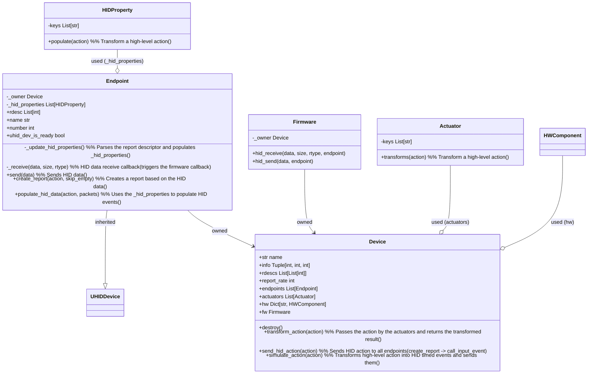
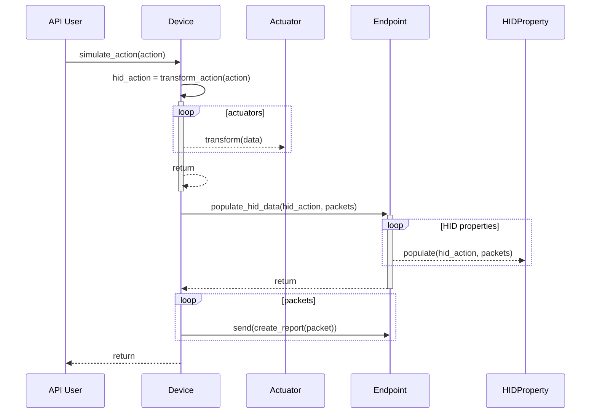
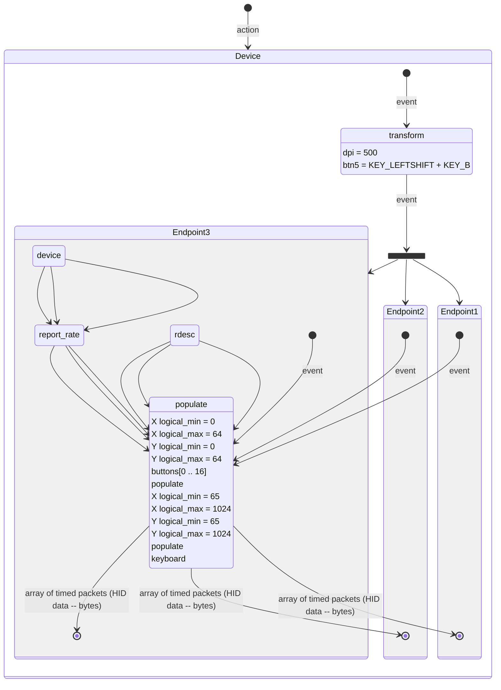

# Architecture overview (class diagram)

```mermaid
classDiagram

class Device {
    +str name
    +info Tuple[int, int, int]
    +rdescs List[List[int]]
    +report_rate int
    +endpoints List[Endpoint]
    +actuators List[Actuator]
    +hw Dict[str, HWComponent]
    +fw Firmware

    +destroy()
    +transform_action(action) %% Passes the action by the actuators and returns the transformed result ()
    +send_hid_action(action) %% Sends HID action to all endpoints (create_report -> call_input_event)
    +simulate_action(action) %% Transforms high-level action into HID timed events and sends them ()
}

class UHIDDevice

Endpoint --|> UHIDDevice : inherited
class Endpoint {
    -_owner Device
    -_hid_properties List[HIDProperty]
    +rdesc List[int]
    +name str
    +number int
    +uhid_dev_is_ready bool

    -_update_hid_properties() %% Parses the report descriptor and populates _hid_properties ()
    -_receive(data, size, rtype) %% HID data receive callback (triggers the firmware callback)
    +send(data) %% Sends HID data ()
    +create_report(action, skip_empty) %% Creates a report based on the HID data ()
    +populate_hid_data(action, packets) %% Uses the _hid_properties to populate HID events ()
}
Endpoint --> Device : owned

class Firmware {
    -_owner Device

    +hid_receive(data, size, rtype, endpoint)
    +hid_send(data, endpoint)
}
Firmware --> Device : owned

class Actuator {
    -keys List[str]

    +transforms(action) %% Transform a high-level action ()
}
Actuator --o Device : used (actuators)

class HWComponent
HWComponent --o Device : used (hw)

class HIDProperty {
    -keys List[str]

    +populate(action) %% Transform a high-level action ()
}
HIDProperty --o Endpoint : used (_hid_properties)
```

# `simulate_action()`

```mermaid
sequenceDiagram

participant API User
participant Device
participant Actuator
participant Endpoint
participant HIDProperty

API User->>Device: simulate_action(action)

Device->>+Device: hid_action = transform_action(action)
loop actuators
    Device-->>Actuator: transform(data)
end
Device-->>-Device: return

Device->>+Endpoint: populate_hid_data(hid_action, packets)
loop HID properties
    Endpoint-->>HIDProperty: populate(hid_action, packets)
end
Endpoint-->>-Device: return

loop packets
    Device->>Endpoint: send(create_report(packet))
end

Device-->>API User: return
```

### Example state diagram

```mermaid
stateDiagram

[*] --> Device : action

state Device {
    state fork_state <<fork>>

    transform : transform
    transform : dpi = 500
    transform : btn5 = KEY_LEFTSHIFT + KEY_B

    [*] --> transform : event

    transform --> fork_state : event

    fork_state --> Endpoint1
    fork_state --> Endpoint2
    fork_state --> Endpoint3

    state Endpoint1 {
        populate : populate
        populate : X logical_min = 0
        populate : X logical_max = 64
        populate : Y logical_min = 0
        populate : Y logical_max = 64
        populate : buttons[0 .. 16]

        device --> report_rate
        report_rate --> populate

        rdesc --> populate

        [*] --> populate : event
        populate --> [*] : array of timed packets (HID data -- bytes)
    }

    state Endpoint2 {
        populate : populate
        populate : X logical_min = 65
        populate : X logical_max = 1024
        populate : Y logical_min = 65
        populate : Y logical_max = 1024

        device --> report_rate
        report_rate --> populate

        rdesc --> populate

        [*] --> populate : event
        populate --> [*] : array of timed packets (HID data -- bytes)
    }

    state Endpoint3 {
        populate : populate
        populate : keyboard

        device --> report_rate
        report_rate --> populate

        rdesc --> populate

        [*] --> populate : event
        populate --> [*] : array of timed packets (HID data -- bytes)
    }
}
```
